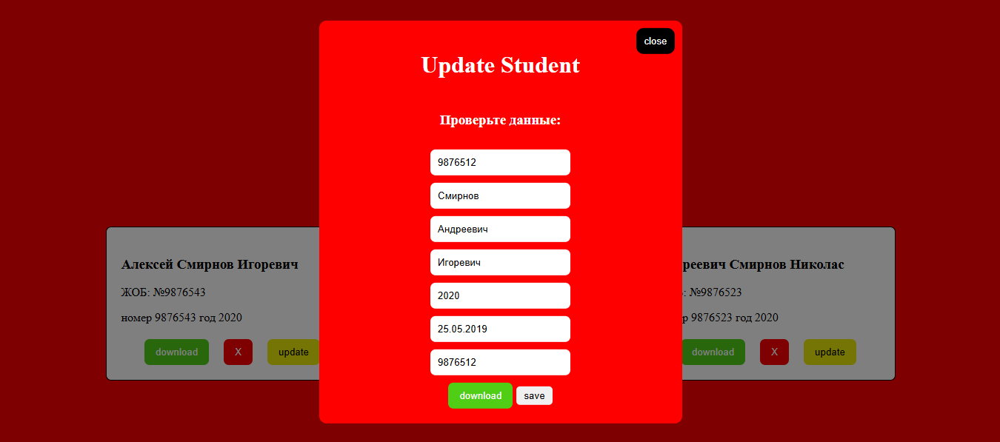
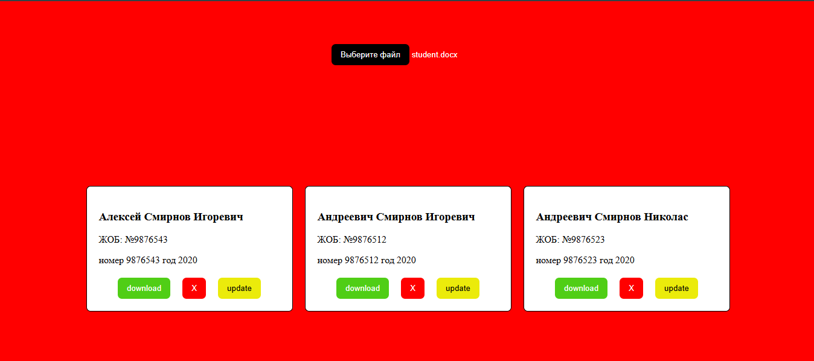

# 🎓 Diploma Generator App

An intelligent web application designed to automate the creation and management of student diploma documents. Simply upload student data in various formats, edit details in real-time, and generate ready-to-print documents.

---
## Screen 


---

## 🛠 Tech Stack

* **Frontend:** [React](https://reactjs.org/) (TypeScript)
* **Styling:** [SCSS](https://sass-lang.com/) / CSS Modules
* **Markup:** HTML5 & Semantic CSS
* **File Handling:** [Mammoth.js](https://github.com/mwilliamson/js-mammoth) (DOCX), [PDF.js](https://mozilla.github.io/pdf.js/) (PDF), and Native JSON parsing.

---

## 🚀 Key Features

* **Multi-Format Import:** Drag & drop `.docx`, `.json`, or `.pdf` files to automatically extract student lists.
* **Interactive Editor:** Seamlessly edit student names, thesis topics, and grades before final generation.
* **Data Management:** Easily add new records manually, update existing ones, or delete specific entries.
* **Smart Export:** Download individual generated diplomas or bulk export processed data.

---

## 📂 Project Structure (`src`)

The project follows a modular architecture for scalability and clean code:

```text
src/
├── assets/             # Images, icons, and static fonts
├── components/         # Reusable UI components (Modals, Tables, Forms)
├── styles/             # Global SCSS files, variables, and mixins
└── utils/              # Core business logic
    ├── hooks/          # Custom React hooks (e.g., useParser, useLocalStorage)
    ├── func/           # Pure helper functions (text processing, date formatting)
    └── const/          # Global constants, API configs, and TS interfaces
├── App.tsx             # Root component & Routing
└── main.tsx            # Application entry point
```
---
## Getting Started
```bash
git clone [https://github.com/your-username/diploma-generator.git](https://github.com/your-username/diploma-generator.git)
npm install
npm run dev
```

---
## How It Works
Upload: Provide a file containing student information.

Process: The app parses the file via utils/func logic and displays the data in an editable grid.

Refine: Correct any typos or modify specific fields directly in the UI.

Download: Generate and save the final diploma document for the selected students.
